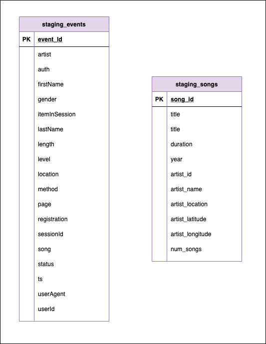
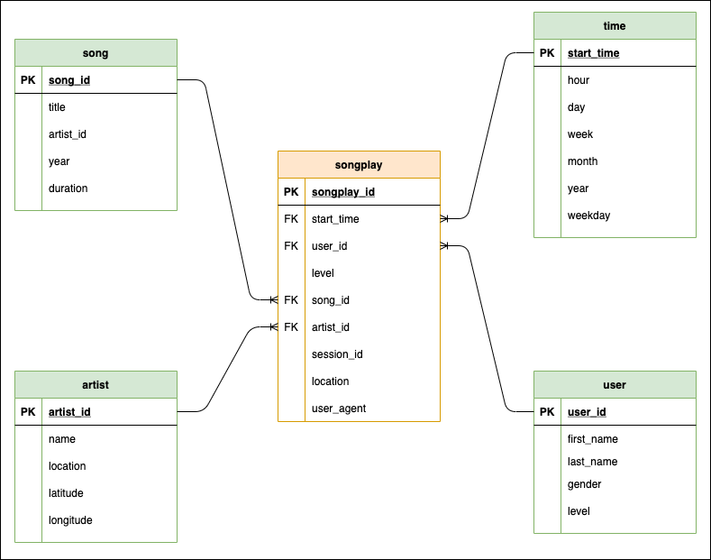

# Redshift Data Warehouse

Third project for Udacity's Data Engineer Nano-Degree

- [Redshift Data Warehouse](#redshift-data-warehouse)
  - [Situation](#situation)
  - [Task](#task)
  - [Analysis](#analysis)
    - [From S3 to staging tables](#from-s3-to-staging-tables)
    - [From staging to analytics tables](#from-staging-to-analytics-tables)
  - [Results](#results)
- [How to Run](#how-to-run)
  - [Starting a Redshift cluster](#starting-a-redshift-cluster)
  - [Running the ETL pipeline](#running-the-etl-pipeline)

## Situation

Sparkify, a music streaming company, has some local song records as well as some
history on user activity. The analytics team wants to understand what songs
people are listening to.

Since the song files and user data files currently live in json files on S3,
it is hard to generate this type of insights. The analytics team would like to
leverage the cloud's distributed nature and horizontal scalability capacity.

## Task

The task is twofold. First we need to load the raw data from S3 into Redshift
staging tables. Then we need to build analytics tables following a star schema.

## Analysis

### From S3 to staging tables

The first step in our ETL pipeline is to get the json data out of S3 and into
staging tables in Redshift. These staging tables are ephemeral and will only be
used to populate the analytics fact and dimension tables.

In order to populate these tables we'll be using the `COPY` command to extract
data from S3 directly. The two staging tables simply contain the same columns as
in the original log and songs json files.

<i>The two staging tables</i>

### From staging to analytics tables

Once the two staging tables have been created in Redshift, the next step in our
ETL pipeline is to create our analytics fact and dimension tables and populate
them directly from the staging tables using the `INSERTO INTO SELECT` syntax.

The analytics tables follow (although not purely) a star schema, with a Fact
table comprised of songplay information and Dimension tables for users, artists,
songs, and time.

<i>The analytical tables in a star schema</i>

**Assumptions on Constraints**: Due to a lack of faimliarity with the database
and missing domain expertise we've made some assumptions as to which columns
should be `NOT NULL` in the analytics tables (apart from all primary keys):

- **songplay**: Only the four foreign keys linking to the different dimension
  tables cannot be `NULL`.
- **user**: A user must have a first and last name and level, but gender is
  optional.
- **song**: Only the artist id (which shouldn't really be there, as that would
  link to dimension tables, turning our star schema into something more
  snowflake-like) is required.
- **time**: Since all fields are derived from the timestamp, they're all
  required although the constraints are automatically satisfied.

**On distkeys and sortkeys**: We have chosen **not** to optmise our analytical
tables using distkeys (to divide our tables between the different nodes) or
sortkeys (to sort data within a node). Some of the reasons behind our choice is
that we don't really know what the dimensions of our tables will be (since we're
dealing with subsets of a real database) and some important decisions such as
whether to broadcast dimension tables depend on the size of such tables. In
addition we don't really know the types of queries the analytics team will be
running. If they want to focus more on user aggregations then it would make
sense to set our fact table's `user_id` as the distkey and perhaps sort by time.
If, however the queries would be more focused on top songs or top artists we
could distribute our fact table based on `artist_id` and `song_id`.

## Results

We've created a series of scripts (instructions on how to run below) to
successfully perform all the necessary operations (i.e. create tables, copy data
from S3, etc.).

# How to Run

To run the scripts make sure you have all neccesary packages (as listed in
`requirements.txt`) installed. The easiest way is to create a virtual
environment with your tool of choice (venv, conda), activate it, and run
`pip install -r requirements.txt`.

In order for the ETL pipeline to run, a live and available Redshift cluster is
needed. If you already have a cluster up and running please skip the following
section. 

## Starting a Redshift cluster

The `aws_utils` submodule contains two functions (`create_cluster()` and
`delete_cluster()`) to help manage all necessary AWS resources.

Create a copy of the `aws_template.cfg` named `aws.cfg` and specify your AWS key
and the desired properties for the cluster.

As their name suggests, `create_cluster()` will spin up a cluster (taking care
of adding the necessary role and opening traffic) and `delete_cluster()` will
tear it down.

## Running the ETL pipeline

Once the cluster is up and running, create a copy of `dwh_template.cfg` named
`dwh.cfg` and input your cluster and database information as well as your IAM
role ARN.

The two most important scripts in this repo are:

- **create_tables.py**: Connects to the database, and creates all tables,
  dropping pre-existing ones. This can be run with `python create_tables.py`.

- **etl.py**: The main ETL pipeline which processes the json files in S3,
  populates staging tables and analytics tables. Run it with python `etl.py`.

All queries used in both scripts live in `sql_queries.py`.
